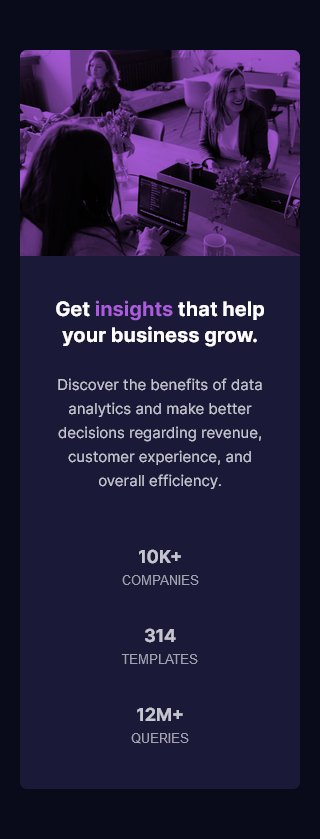

# Frontend Mentor - Stats preview card component solution

This is a solution to the [Stats preview card component challenge on Frontend Mentor](https://www.frontendmentor.io/challenges/stats-preview-card-component-8JqbgoU62). Frontend Mentor challenges help you improve your coding skills by building realistic projects. 

## Table of contents

- [Frontend Mentor - Stats preview card component solution](#frontend-mentor---stats-preview-card-component-solution)
  - [Table of contents](#table-of-contents)
  - [Overview](#overview)
    - [The challenge](#the-challenge)
    - [Screenshot](#screenshot)
    - [Links](#links)
  - [My process](#my-process)
    - [Built with](#built-with)
    - [Useful resources](#useful-resources)
  - [Author](#author)

## Overview

### The challenge

Users should be able to:

- View the optimal layout depending on their device's screen size

### Screenshot

### Links

- Solution URL: [Github Solution](https://github.com/wigzen/Frontend-Mentor/tree/main/stats-preview-card-component-main)
- Live Site URL: [https://pb4qvp.csb.app/](https://pb4qvp.csb.app/)

## My process

### Built with

- Semantic HTML5 markup
- CSS custom properties
- Flexbox
- CSS Grid

### Useful resources

- [Grid Guide](https://css-tricks.com/snippets/css/complete-guide-grid/) - This helped me for centering the section. I really liked this pattern and will use it going forward.
- [Flexbox Guide](https://css-tricks.com/snippets/css/a-guide-to-flexbox/) - This is an amazing article which helped me finally understand Flexbox. I'd recommend it to anyone still learning this concept.

## Author

- Frontend Mentor - [@wigzen](https://www.frontendmentor.io/profile/wigzen)
- Twitter - [@VikasLodh](https://twitter.com/VikasLodh)
